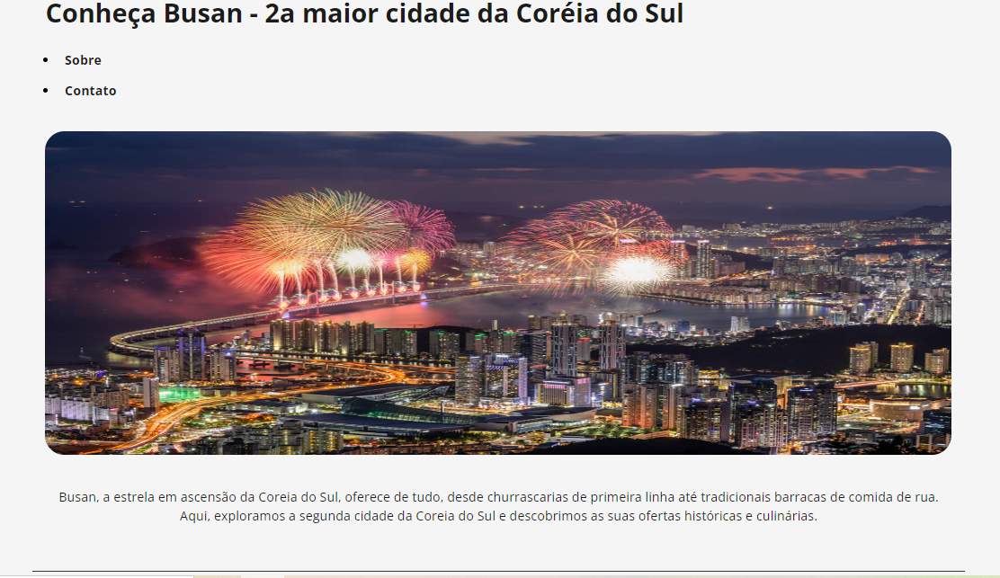
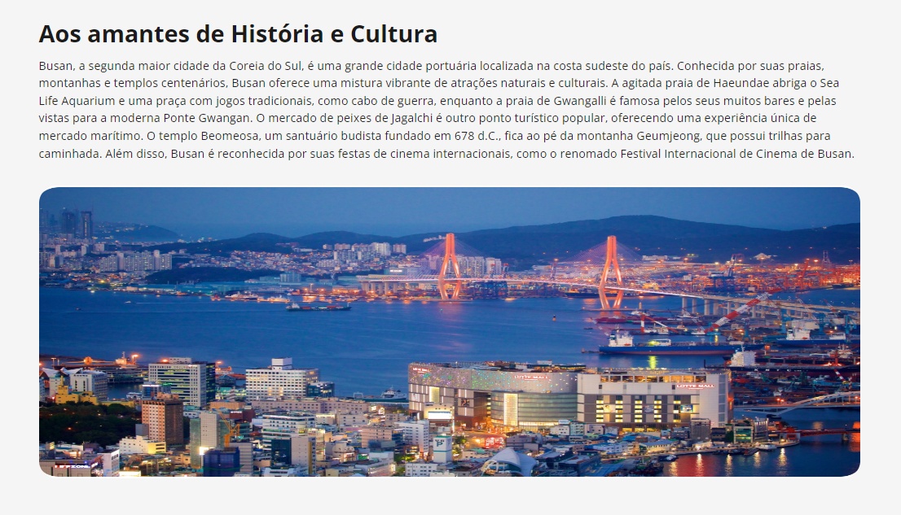
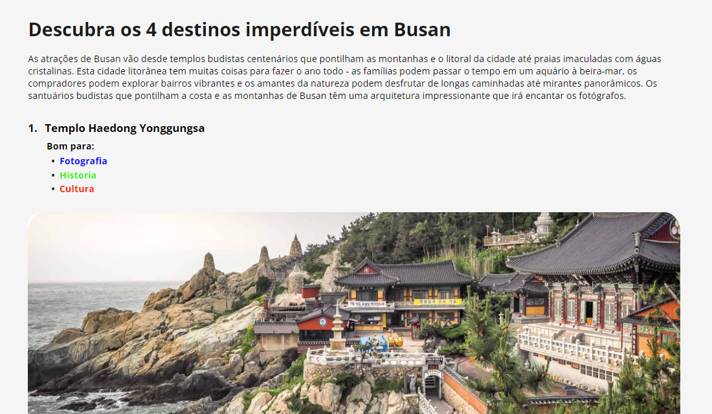
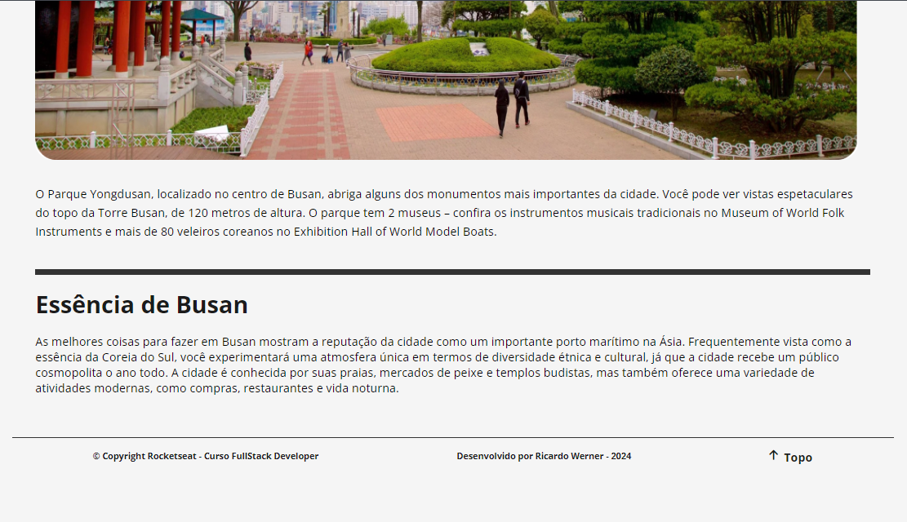

# Rocketseat_FullStack_Desafio_Pratico_Local_Turistico
## Projeto de Reforço

#### Criação de uma landing page de um local turistico em HTML e CSS

### 🔗 Links
[](https://github.com/ricardo-werner)

[](https://www.linkedin.com/in/ricardo-werner)


Status - Concluído

### Demonstração

Tela inicial da landing page
<p align="center">
  
</p>

Tela História da landing page
<p align="center">
  
</p>

Tela Destinos da landing page
<p align="center">
  
</p>

Tela Fechamento e Contato da landing page
<p align="center">
  
</p>


### O Desafio
Neste projeto foi proposto criar uma página com informações turistica de um local já determinado e detalhada no Figma, utilizando os conceitos iniciais de HTML e CSS do curso Full-Stack da Rocketseat.

### Requisitos da Página

| Item  | Descrição                                            
| ----- | ----------------------------------------------------------------------|
|  1    |  A página deverá ser desenvolvida em HTML e CSS.                      |
|  2    |  O sistema deverá seguir o design no Figma.                           |
|  3    |  Modelagem do layout, formatos, tipografias e cores conforme Figma.   |


### Formato da Página

| Item                   | Descrição                                            
| ---------------------- | ------------------------------------------------------------------------|
|  Cabeçalho             | Informações iniciais da página informando a cidade.                     |
|  Sobre                 | Inicio do detalhamento das principais informações turisticas da cidade. |
|  Fechamento            | Considerações finais sobre a cidade.                                    |
|  Rodapé                | Informações adicionais de contato, desenvolvedor e redes sociais.       |


### Plano do Projeto

No desenvolvimento desta página, coloquei em prática:

| Item  | Descrição                                            
| ----- | ------------- |
|  1    |  HTML         |
|  2    |  CSS          |
|  3    |  Javascript   |
|  4    |  Skills       |

### Tecnologias utilizadas:

- Visual Studio Code
- Vídeos do curso Full-Stack da Rocketseat
- Documentações 
- ChatGPT


Este projeto contribuiu significativamente para o aprimoramento do uso de estruturas em HTML e CSS. Mostrou-me como algo aparentemente simples pode, às vezes, parecer confuso, exigindo recursos adicionais para encontrar a solução adequada. Com o apoio dos vídeos iniciais do curso, tornou-se mais fácil entender as estruturas e otimizar as configurações no CSS. Além disso, o projeto incentivou a pensar em formas de estruturar uma página que facilitem futuras manutenções.

## Para utilizar este projeto como base, faça o seguinte passo-a-passo:

Clone o projeto para a sua máquina
```bash
https://github.com/ricardo-werner/Rocketseat_FullStack_Desafio_Pratico_Local_Turistico.git
```
- Rode o projeto

```bash
ativar o GO LIVE no VSCode
```

## Autor

Ricardo Werner
Dev Full-Stack em desenvolvimento - 
Rocketseat_2024